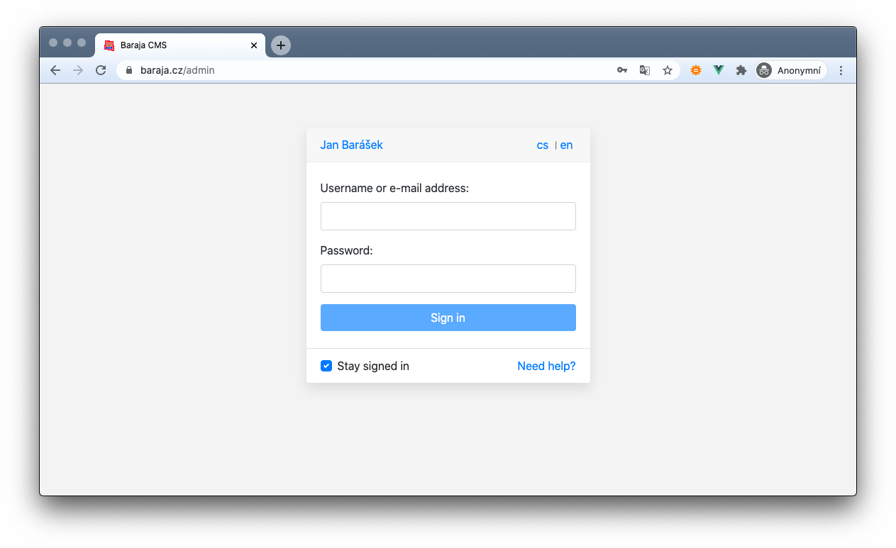

Baraja CMS
==========

Baraja CMS is a new generation administration system written in the latest technologies for PHP.
Read more on the [official product page](https://baraja.cz/cms).



Baraja CMS (Content manage system) is an administration interface for content management of websites and e-shops. The content is managed by the client himself, so it is necessary to carefully debug the individual functional elements.

Basic philosophy
----------------

Baraja CMS was designed as a simple, fully stand-alone application that allows you to log in to the website and manage it intelligently.

The package automatically ensures the creation of the basic software of the project (basic database tables, user profiles, admin panel and support for plugins).

Because each project is a little different, this administration interface can automatically adapt to the project where it is running. This was achieved mainly by the fact that the CMS itself has the smallest possible dependencies and the individual functions are supplied by the installed plugins. The CMS then provides communication between them and renders the data to the user.

Installation
---------

Installation is possible only with Composer:

```shell
$ composer require baraja-core/cms
```

After installing the package, register the DIC extension to ensure complete configuration of all services.

Please use in your `common.neon`:

```yaml
extensions:
   cms: Baraja\Cms\CmsExtension
```

Plugins and extensions
-------------------

The CMS has been created for scalability since the original design.

Extensions are made through so-called plugins, which can be defined anywhere. The CMS is therefore fully independent of the specific project implementation and we can combine plugins from different sources (most often plugins from installed packages supplemented by plugins from a specific project implementation).

Because plugins are often defined within specific packages, which do not necessarily depend on the CMS, it makes great sense to implement plugins elsewhere in a separate package that requires both a specific package (such as articles) and the CMS itself that obtains data from it. This package is called [Plugin system](https://github.com/baraja-core/plugin-system) and defines a general environment for all types of services, components, plugins and the links between them.

Custom plugin and view types
----------------------------

A general plugin is defined as an unfocused entity. Only the CMS makes sense to it, because it defines the way it will be rendered.

To make it easy to define and extend new features, the CMS defines a set of basic layout templates and components to which plugins provide content based on which page the user is on.

The page URL has the following forms:

- `/admin` (the system `HomepagePlugin` with `default` action will be rendered)
- `/admin/article` (`ArticlePlugin` with `default` actions` will be rendered)
- `/admin/article/detail` (`ArticlePlugin` with `detail` actions will be rendered)
- `/admin/article/detail?id=1` (`ArticlePlugin` with `detail` action is drawn and the parameter `id=1` is passed)

Each plugin reserves its own namespace in the URL (for example `Article`) and only it can interfere with its content. At the same time, it reserves all combinations of addresses with the specified namespace (for example, `article/create`), which the plugin developer can freely use.

> **Remember:**
>
> **Rendering a specific page in the CMS always means creating an instance of a specific plugin with its specific view.**

Plugin and its default view
----------------------------

If the plugin contains only one component, it will have the entire page space to itself. In this case, the developer needs to implement a complete page layout.

In order for all pages to be the same and only their content to change, we have prepared a set of ready-made layout components that define the general layout of the elements on the page and can be easily used by the developer.

For example, defining an overview of articles with a title, crumb navigation, buttons, and main table content might look elegant:

```js
Vue.component('article-default', {
    template: `<cms-default title="Article manager" :breadcrumb="breadcrumb" :buttons="buttons">
        <b-modal id="modal-new-article" title="Compose a new article">
            <textarea class="w-100 form-control"></textarea>
        </b-modal>
        <table class="table table-sm">
            <tr>
                <th>Title</th>
            </tr>
            <tr>
                <td>We have created a new website!</td>
            </tr>
        </table>
    </cms-default>`,
    data() {
        return {
            breadcrumb: [
                {
                    label: 'Dashboard',
                    href: '#'
                },
                {
                    label: 'Articles',
                    href: '#'
                }
            ],
            buttons: [
                {
                    variant: 'primary',
                    label: 'Compose a new article',
                    icon: 'fa-plus',
                    action: 'modal',
                    target: 'modal-new-article'
                },
                {
                    variant: 'danger',
                    label: 'Click here',
                    action: 'linkTab',
                    target: '/'
                }
            ]
        }
    }
});
```

Note that the `<cms-default>` component was used to render the main page layout, which serves as the default layout.

Plugin with a group of components (bookmarks)
--------------------------------------

Most plugins allow you to edit the parent entity in a detailed view that we want to contain more than one component.

CMS has native support for chaining two or more components into bookmarks, where only the first bookmark and the other `lazy` are automatically drawn when the page is loaded, after clicking on the bookmark name. If the user switches multiple tabs, those already open remain loaded in the operating memory so that he can work with them again without further delay.

The bookmarked design is rendered automatically when there are at least 2 components on the page. For this to happen, the routing must match for one plugin with either multiple components that have the same view (property `view`) or multiple plugins whose home entity meets a common interface to the currently rendered plugin (for example, an SEO component is automatically rendered), and at the same time it corresponds to the type of view (the behavior may differ, for example, for comparators, when we want to draw a different type of component in the category and another type in the product detail).

However, the general layout of the component cannot be used on the detail page, because all components are drawn inside the bookmarks and the bookmark system itself defines the CMS automatically within the internal logic.

In order to be able to influence the appearance of the page (and especially the content), the CMS implements optional extensions.

Most often we want to draw, for example, the detail of the article, while:

- We will place the name of the current article in the header according to its ID in the URL
- According to the installed plugins and available routes, we will display the control buttons
- We will generate crumb navigation (which may vary by category and other factors)
- We draw internal components for editing (article content, category management and history)
- We draw related components (such as SEO), but the CMS does this automatically
- We will set other control properties for the user, such as the `Save all` button and more

For all this to work, the base class for the `Plugin` needs to be extended. This is ensured by the plugin inheriting the `BasePlugin` class in the [Plugin system package](https://github.com/baraja-core/plugin-system), which adds additional optional behaviors and custom helpers.

Therefore, when creating a plugin instance and rendering it to the CMS, the so-called "action" method in the form of `action<ActionName>` is called first, and it can accept URL parameters as function arguments. The behavior is similar to the Nette framework in the case of Presenter.

Technically, it can look like this in the code, for example:

```php
final class ArticlePlugin extends BasePlugin
{
    public function actionDetail(string $id): void
    {
        $this->setTitle('Detail článku');

        $this->addButton(new Button(
            Button::VARIANT_INFO,
            'My button',
            Button::ACTION_LINK_TAB,
            '/'
        ));

        $this->addBreadcrumb(new Breadcrumb('Hlavní strana', '/'));
        $this->addBreadcrumb(new Breadcrumb('Kategorie článku', '/category'));
        $this->addBreadcrumb(new Breadcrumb('Další kategorie', '/category-2'));
        $this->addBreadcrumb(new Breadcrumb('Název článku', '/article/detail?id=1'));
    }
}
```

Important notes:

- Within the plugin, you can get instances of other services via the constructor (this is a common Nette service), so it's a good idea to inject `ArticleManager` and then use it.
- The title (`setTitle()` method) can be defined dynamically depending on which article I am currently on.
- For more complex cases, also set a subtitle (`setSubtitle()` method).
- Buttons (`addButton()` and `addContextMenu()` methods) can be freely defined and it is a good idea to expand their list according to the availability of other functions for users. Buttons can open links (in the same or a new window), open modals or call a javascript function (in the case of a method within a Vue component).
- For the `Back` button to work, you need to define the URL of the previous page with the `setLinkBack()` method.
- The `Save All` button must be enabled over a specific plugin by calling the `setSaveAll(true)` method).
- If you can, set up a context menu with useful links for users (for example, to display an article on the front end or various links to available language versions of the article).

Loading styles and scripts
--------------------------

All CSS styles of the entire CMS are minified into one large file and stored on the [Baraja CDN server](https://cdn.baraja.cz). The main reason is that the installation of the CMS does not require any additional dependencies, which would, for example, require the CMS to contain a style file and it must return to a special URL.

Thanks to this principle, we have all styles under control and the plugin developer does not have the opportunity to change anything in them. This is the only way to ensure that all plugins and components use a basic defined design system (Bootstrap + our helpers) and that all parts of the CMS look almost the same.

However, scripts are defined by each plugin separately, in the form of Vue components.

The CMS core ensures the assembly of all components for a given plugin and their joint assembly into one large javascript file, which is downloaded to the user when opening the first page with the plugin. Furthermore, it has the entire plugin downloaded in the cache and can very effectively control only specific components. This service serves as a Proxy tunnel, which allows you to load javascript from different physical locations at once (most often from a vendor in combination with its own components within a specific project).

Vue components should use only pre-built styles and other CMS components to look as similar as possible and the user immediately understands their main principles.
